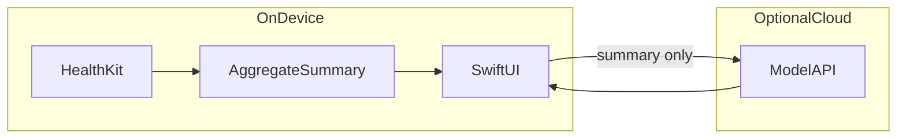

# MVP 技术实施计划（形式 B：iOS + HealthKit）

对应 [PRODUCT_DECISIONS.md](./PRODUCT_DECISIONS.md) 中锁定的 **v0.1 = iOS App + HealthKit 直读**。

## 1. 输入数据（分析范围）

- **来源**：HealthKit（用户授权后由 App 查询）；**不区分**样本最初来自哪台设备或 App，凡写入用户「健康」且已授权的类型即可参与分析。

### 1.1 经期相关

- **v0.1 建议纳入**（按实现难度与价值排序，可砍项但需在 PR 中说明）：
  - `HKCategoryTypeIdentifierMenstrualFlow`
  - 可选：`HKCategoryTypeIdentifierCervicalMucusQuality`、`HKQuantityTypeIdentifierBasalBodyTemperature`、`HKCategoryTypeIdentifierOvulationTestResult`
- **周期叙事补充（高相关，与流量等一并授权读取；摘要化使用）**：用户在「健康」中若曾记录，可纳入分析上下文（无样本则跳过）：
  - `HKCategoryTypeIdentifierIntermenstrualBleeding`
  - `HKCategoryTypeIdentifierIrregularMenstrualCycles`
  - `HKCategoryTypeIdentifierInfrequentMenstrualCycles`
  - `HKCategoryTypeIdentifierProlongedMenstrualPeriods`
  - `HKCategoryTypeIdentifierPersistentIntermenstrualBleeding`

### 1.2 生活与周期上下文字段（v0.1 纳入分析）

用于**周期向上下文**（若有样本）与**生活向建议**（运动、休息、节奏等）；均只以**聚合摘要**进入 Prompt，避免医学因果断定式表述。

| 分析用途 | HealthKit 类型（示例标识符） | 说明 |
|----------|------------------------------|------|
| 周期向辅助 | `HKQuantityTypeIdentifierAppleSleepingWristTemperature` | 无样本时摘要为空即可 |
| 活动 | `HKQuantityTypeIdentifierActiveEnergyBurned`、`HKQuantityTypeIdentifierStepCount`、`HKQuantityTypeIdentifierAppleExerciseTime`、`HKQuantityTypeIdentifierAppleStandTime` | 可与锻炼摘要一起聚合 |
| 睡眠 | `HKCategoryTypeIdentifierSleepAnalysis` | 按段聚合总时长等，具体粒度以实现为准 |
| 心率 / 恢复向上下文 | `HKQuantityTypeIdentifierHeartRate`、`HKQuantityTypeIdentifierRestingHeartRate`、`HKQuantityTypeIdentifierHeartRateVariabilitySDNN` | 建议用区间/日均等摘要，避免逐条上传 |
| 可选增强 | `HKQuantityTypeIdentifierOxygenSaturation`、`HKQuantityTypeIdentifierRespiratoryRate` | 仅当产品文案与权限列表一并更新时纳入 |
| 锻炼详情 | Workout（`HKObjectType.workoutType()`） | 聚合运动类型分布、次数、总时长/消耗等；与「活动」量互补 |
| 饮食与饮水 | `HKQuantityTypeIdentifierDietaryWater`、`HKQuantityTypeIdentifierDietaryEnergyConsumed` | 第三方写入质量不一；有则做区间/日均摘要，无数据不推断 |
| 正念 / 放松 | `HKCategoryTypeIdentifierMindfulSession` | 频次、总时长等摘要，服务情绪与作息类建议 |
| 体成分（可选） | `HKQuantityTypeIdentifierBodyMass`、`HKQuantityTypeIdentifierBodyFatPercentage` | 仅趋势或区间摘要；文案须避免减重处方、身体羞辱；纳入前须同步权限说明与产品边界 |

### 1.3 不纳入 v0.1

- `HKCategoryTypeIdentifierSexualActivity` 等敏感类别，除非产品明确需要且通过隐私评审。

### 1.4 建议输出分类（生活向，结果页 / Prompt 维度）

以下为 v0.1 推荐固定的**建议维度**（可与结果页分区、Tab 或折叠块一致）。模型输出须符合非医疗定位（见合规规则）：**可尝试、可参考**，避免「诊断 / 治疗 / 处方」及断定式因果。

| 建议维度 | 主要数据依赖（见上文 §1.1–§1.2） | 可选用户自述（非 HealthKit） | 不做的事（实现与审核约束） |
|----------|-----------------------------------|------------------------------|----------------------------|
| 锻炼与活动 | 活动量、Workout | 运动偏好、禁忌（用户自愿填写） | 不开运动处方或康复方案；重伤痛须引导就医 |
| 饮食与饮水 | 饮食能量、饮水 | 饮食习惯、忌口 | 不替代营养师或疾病饮食治疗；不声称「治愈」 |
| 正念与放松 | 正念 Session | 近期压力源（简述） | 不做心理治疗或精神障碍处置 |
| 睡眠与节律 | 睡眠分析、手腕温度（若有） | 轮班、育儿等作息约束 | 不诊断睡眠障碍；严重失眠须引导就医 |
| 恢复与负荷 | 心率、静息心率、HRV、活动/Workout | 主观疲劳感 | 不断定「身体异常」；不解读为疾病 |
| 经期舒适与节奏 | 经期流量与 §1.1 周期补充类别 | 不适程度（主观，可选） | 不处理急症、不指导用药或医疗器械 |
| 情绪与压力（广义） | 睡眠、活动、正念等弱信号 | 情绪自评、生活事件（可选） | 关联表述须克制；危机情况须有求助/就医引导（产品层单独设计） |

- **数据不足时**：对应维度展示「暂无足够数据」或省略该块，**禁止**捏造与用户数据不符的建议。  
- **体成分**（若启用 §1.2 可选行）：建议维度可单列「整体节奏」或并入饮食/活动，**禁止**羞辱式表述与减重处方语气。

## 2. 解析与隐私边界

- **设备上**：通过 HealthKit 查询得到样本 → 在客户端聚合为**结构化摘要**（时间范围、周期推断、流量与 §1.1 补充类别统计、活动/睡眠/心率、锻炼/饮食饮水/正念、可选体成分等指标的区间或日均）。不在客户端持久化完整导出文件。
- **出端**：仅将**摘要 + 用户可选填的补充上下文**（如自述目标）发往模型 API；请求与响应内容不写入 iCloud 中的可识别健康档案（与主方案 7.2 / 5.1.3 一致）。
- **日志**：生产环境禁止打印原始健康样本；调试日志需脱敏或仅在 Debug 构建启用。

## 3. 技术栈

- **语言 / UI**：Swift（建议 5.9+）、SwiftUI。
- **健康**：HealthKit、`HealthStore` 封装一层 Repository，避免业务层直接散落查询。
- **网络**：`URLSession` 或等价方案；调用模型 API 的 URL 与鉴权方式由实现阶段确定（见下节）。

## 4. 首版用户路径

1. 启动 → 展示**非医疗免责声明**与数据用途说明（可复用合规规则中的表述原则）。
2. 引导用户通过**系统** Health 权限界面授权。
3. 拉取授权范围内的数据 → 生成结构化摘要（数据不足时给出明确提示，不伪造结论）。
4. 用户触发「生成建议」→ 调用 AI → 按 **§1.4** 建议维度展示结果，页面可见**咨询医生**类提示。
5. 设置中提供：数据来源说明、隐私政策链接占位、（若采用）API 端点说明。

## 5. AI 与密钥

- **禁止**在公开发布的 App 二进制中硬编码第三方模型 API Key。
- **推荐**：极简 **BFF（后端转发）** —— 客户端只持有自家后端颁发的会话令牌或短期凭证；健康摘要经 TLS 发送给 BFF，由服务端注入模型 Key。BFF **不落库**原始健康明细，或仅保留可配置的极短调试窗口并默认关闭。
- **备选（个人/内测）**：用户在设置中自行粘贴 Key，仅存储于 Keychain，并明确风险提示；上架前需评估审核与隐私文案。
- **失败行为**：网络错误、限流、空数据时展示可读错误与重试；不输出虚假医学结论。

## 6. v0.1 非目标（明确不做）

- 账号体系、云同步、推送提醒、Widget、独立 watchOS App。
- 付费、订阅、应用内购买。
- 将 HealthKit 数据用于广告或用户画像挖掘。
- 「健康评分」「异常」恐吓式标签（与产品决策一致）。

## 7. 首个迭代可交付任务（示例）

1. Xcode 工程骨架 + 免责声明与设置页占位。
2. HealthKit 授权与读取：`MenstrualFlow`（必选）+ §1.1 周期补充类别与 §1.2 已选类型的**分阶段**接入（例如先经期 + 活动/睡眠，再手腕温度与 HRV，再 Workout/饮食/正念，体成分最后并单独过文案）+ 统一摘要聚合模块。
3. 建议结果页 UI（按 **§1.4** 分区；静态 mock → 接真实 API）。
4. 模型调用层（先接 BFF 或 mock server）+ 错误处理。
5. 隐私政策 URL 占位与 App 内「读取了哪些数据」说明页（须列出 §1.1–§1.2 中实际请求授权的类型及用途）。

## 8. 验证建议

- 真机：无数据、仅部分类型授权、全部拒绝授权三种情况。
- 审核预检：对照 `.cursor/rules/appstore-health-compliance.mdc` 与主方案第七节走查文案与数据说明。
